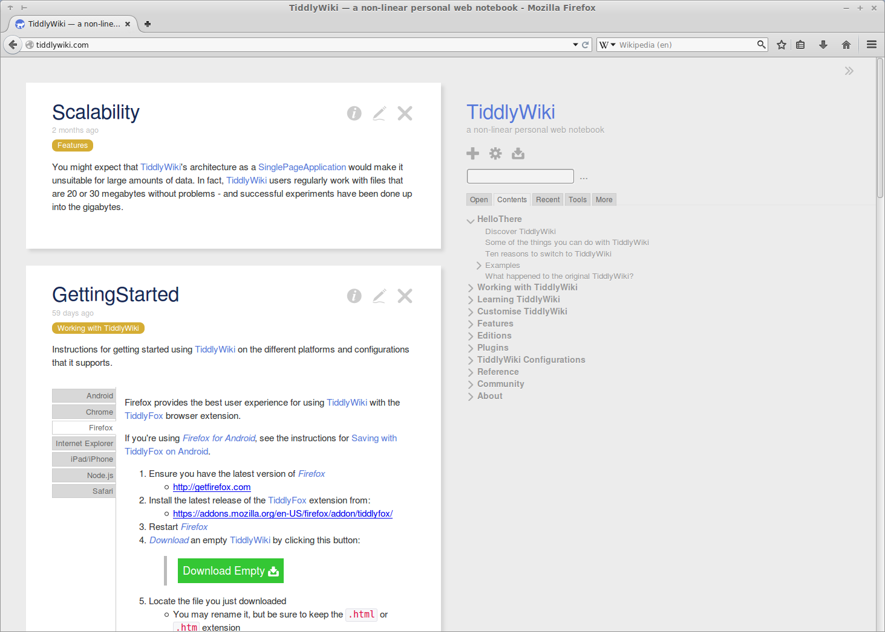

# TiddlyWiki for YunoHost

[](https://dash.yunohost.org/appci/app/tiddlywiki)    
[](https://install-app.yunohost.org/?app=tiddlywiki)

*[Lire ce readme en français.](./README_fr.md)*

> *This package allow you to install TiddlyWiki quickly and simply on a YunoHost server.  
If you don’t have YunoHost, please see [here](https://yunohost.org/#/install) to know how to install and enjoy it.*

## Overview
TiddlyWiki is a non-linear personal web notebook that anyone can use and keep forever, independently of any corporation.
TiddlyWiki is a complete interactive wiki in JavaScript. It can be used as a single HTML file in the browser or as a powerful Node.js application. It is highly customisable: the entire user interface is itself implemented in hackable WikiText.

**Shipped version:** 5.1.23

## Screenshots



## Demo

* [Official demo](https://tiddlywiki.com/)

## Documentation

 * Official documentation: Link to the official documentation of this app
 * YunoHost documentation: If specific documentation is needed, feel free to contribute.

#### Supported architectures

* x86-64 - [](https://ci-apps.yunohost.org/ci/apps/tiddlywiki/)
* ARMv8-A - [](https://ci-apps-arm.yunohost.org/ci/apps/tiddlywiki/)

## Links

 * Report a bug: https://github.com/YunoHost-Apps/tiddlywiki_ynh/issues
 * App website: https://tiddlywiki.com/
 * Upstream app repository: https://github.com/Jermolene/TiddlyWiki5
 * YunoHost website: https://yunohost.org/

---

## Developers info

Please do your pull request to the [testing branch](https://github.com/YunoHost-Apps/tiddlywiki_ynh/tree/testing).

To try the testing branch, please proceed like that.
```
sudo yunohost app install https://github.com/YunoHost-Apps/tiddlywiki_ynh/tree/testing --debug
or
sudo yunohost app upgrade tiddlywiki -u https://github.com/YunoHost-Apps/tiddlywiki_ynh/tree/testing --debug
```
