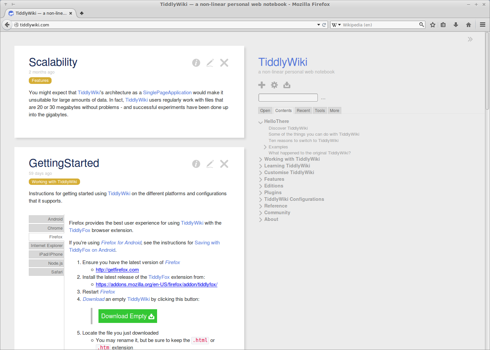

<!--
N.B.: This README was automatically generated by https://github.com/YunoHost/apps/tree/master/tools/README-generator
It shall NOT be edited by hand.
-->

# TiddlyWiki pour YunoHost

[](https://dash.yunohost.org/appci/app/tiddlywiki)    
[](https://install-app.yunohost.org/?app=tiddlywiki)

*[Read this readme in english.](./README.md)*

> *Ce package vous permet d'installer TiddlyWiki rapidement et simplement sur un serveur YunoHost.
Si vous n'avez pas YunoHost, regardez [ici](https://yunohost.org/#/install) pour savoir comment l'installer et en profiter.*

## Vue d'ensemble

TiddlyWiki is a complete interactive wiki in JavaScript. It can be used as a single HTML file in the browser or as a powerful Node.js application. It is highly customisable: the entire user interface is itself implemented in hackable WikiText.

**Version incluse :** 5.2.2~ynh1

**Démo :** https://tiddlywiki.com/

## Captures d'écran




## Avertissements / informations importantes

## Save your Tiddlers!

It is very important that you regularly backup your notes (tiddlers) locally.

- Click on the cloud icon -> `Save snapshot for offline use`

To restore a local backup to the server, drag and drop your tiddlers backup file into your TiddlyWiki page.


## Documentations et ressources

* Site officiel de l'app : <https://tiddlywiki.com/>
* Documentation officielle de l'admin : <https://tiddlywiki.com/>
* Dépôt de code officiel de l'app : <https://github.com/Jermolene/TiddlyWiki5>
* Documentation YunoHost pour cette app : <https://yunohost.org/app_tiddlywiki>
* Signaler un bug : <https://github.com/YunoHost-Apps/tiddlywiki_ynh/issues>

## Informations pour les développeurs

Merci de faire vos pull request sur la [branche testing](https://github.com/YunoHost-Apps/tiddlywiki_ynh/tree/testing).

Pour essayer la branche testing, procédez comme suit.

``` bash
sudo yunohost app install https://github.com/YunoHost-Apps/tiddlywiki_ynh/tree/testing --debug
ou
sudo yunohost app upgrade tiddlywiki -u https://github.com/YunoHost-Apps/tiddlywiki_ynh/tree/testing --debug
```

**Plus d'infos sur le packaging d'applications :** <https://yunohost.org/packaging_apps>
